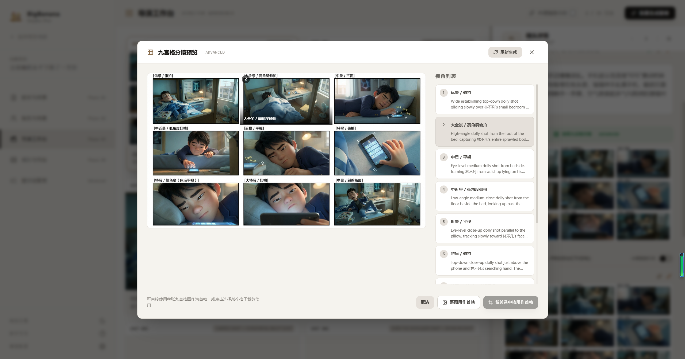

# BigBanana AI Director (AI 漫剧工场)

> **AI 一站式短剧/漫剧生成平台**
> *Industrial AI Motion Comic & Video Workbench*

[](./README.md)
[](./README_EN.md)
[](./README_JA.md)
[](https://creativecommons.org/licenses/by-nc-sa/4.0/)

**BigBanana AI Director** 是一个 **AI 一站式短剧/漫剧平台**，面向创作者,实现从灵感到成片的高效生产。

它摇弃了传统的"抽卡式"生成，采用 **"Script-to-Asset-to-Keyframe"** 的工业化工作流。通过深度集成 AntSK API 的先进 AI 模型，实现 **"一句话生成完整短剧，从剧本到成片全自动化"**，同时精准控制角色一致性、场景连续性与镜头运动。

## 界面展示

### 项目管理


### Phase 01: 剧本与分镜


### Phase 02: 角色与场景资产


### Phase 03: 导演工作台




### Phase 04: 成片导出


### 提示词管理


## 核心理念：关键帧驱动 (Keyframe-Driven)

传统的 Text-to-Video 往往难以控制具体的运镜和起止画面。BigBanana 引入了动画制作中的 **关键帧 (Keyframe)** 概念：
1.  **先画后动**：先生成精准的起始帧 (Start) 和结束帧 (End)。
2.  **插值生成**：利用 Veo 模型在两帧之间生成平滑的视频过渡。
3.  **资产约束**：所有画面生成均受到“角色定妆照”和“场景概念图”的强约束，杜绝人物变形。

## 核心功能模块

### Phase 01: 剧本与分镜 (Script & Storyboard)

* **智能剧本拆解**：输入小说或故事大纲，AI 自动拆解为包含场次、时间、气氛的标准剧本结构。
* **视觉化翻译**：自动将文字描述转化为专业的 Midjourney/Stable Diffusion 提示词。
* **节奏控制**：支持设定目标时长（如 30s 预告片、3min 短剧），AI 自动规划镜头密度。
* **✨ 手动编辑 (NEW)**：
  * 编辑角色视觉描述和分镜画面提示词
  * 编辑每个分镜的角色列表（添加/移除角色）
  * 编辑分镜的动作描述和台词
  * 确保生成结果符合预期，精准控制每个细节

### Phase 02: 资产与选角 (Assets & Casting)

* **一致性定妆 (Character Consistency)**：
  * 为每个角色生成标准参考图 (Reference Image)。
  * **衣橱系统 (Wardrobe System)**：支持多套造型 (如：日常、战斗、受伤)，基于 Base Look 保持面部特征一致。
* **场景概念 (Set Design)**：生成环境参考图，确保同一场景下的不同镜头光影统一。

### Phase 03: 导演工作台 (Director Workbench)

* **网格化分镜表**：全景式管理所有镜头 (Shots)。
* **精准控制**：
  * **Start Frame**: 生成镜头的起始画面（强一致性）。
  * **End Frame**: (可选) 定义镜头结束时的状态（如：人物回头、光线变化）。
* **九宫格分镜预览 (NEW)**：
  * 一键拆分同一镜头的 9 个视角，先确认描述再生成九宫格图。
  * 支持“整图用作首帧”或“裁剪单格用作首帧”，快速确定构图方案。
* **上下文感知**：AI 生成镜头时，会自动读取 Context（当前场景图 + 当前角色特定服装图），彻底解决"不连戏"问题。
* **视频生成双模式**：支持单图 Image-to-Video，也支持首尾帧 Keyframe Interpolation。

### Phase 04: 成片与导出 (Export)

* **实时预览**：时间轴形式预览生成的漫剧片段。
* **渲染追踪**：实时监控 API 渲染进度。
* **资产导出**：支持导出所有高清关键帧和 MP4 片段，方便导入 Premiere/After Effects 进行后期剪辑。

## 技术架构

*   **Frontend**: React 19, Tailwind CSS (Sony Industrial Design Style)
*   **AI Models**:
    *   **Logic/Text**: `gpt-5.1` (高智能剧本分析)
    *   **Vision**: `gemini-3-pro-image-preview` (高速绘图)
    *   **Video**: `veo_3_1_i2v_s_fast_fl_landscape` / `sora-2` (首尾帧视频插值)
*   **Storage**: IndexedDB (本地浏览器数据库，数据隐私安全，无后端依赖)

## 为什么选择 AntSK API？

本项目深度集成 [**AntSK API 平台**](https://api.antsk.cn/)，为创作者提供极致性价比的 AI 能力：

### 🎯 全模型覆盖
* **文本模型**: GPT-5.2、GPT-5.1、Claude 3.5 Sonnet
* **视觉模型**: Gemini 3 Pro、Nano Banana Pro
* **视频模型**: Sora 2、Veo 3.1 (支持关键帧插值)
* **一站式调用**：统一 API 接口，无需多平台切换

### 💰 超值定价
* **官方 2 折以下**：所有模型价格均低于官方渠道 80%
* **按需计费**：无最低消费，用多少付多少
* **企业级稳定性**：99.9% SLA 保障，7x24 技术支持

### 🚀 开发者友好
* **OpenAI 兼容协议**：零代码迁移成本
* **详细文档**：完整的 API 文档和示例代码
* **实时监控**：可视化用量统计和费用追踪

[**立即注册领取免费额度**](https://api.antsk.cn/) →

---

## 💬 加入交流群

扫码加入【大香蕉】产品体验群，与其他创作者交流经验、获取最新功能更新：

<div align="center">

<p><i>微信扫码加入交流群</i></p>
</div>

---

### 🎨 轻量级创作工具推荐

如果你需要**快速完成单次创作任务**，可以试试我们的在线工具平台：

**[BigBanana 创作工坊](https://bigbanana.tree456.com/)** 提供：
* 📷 **[AI 绘图](https://bigbanana.tree456.com/gemini-image.html)**：文字转图片，支持多种风格
* 📊 **[AI PPT](https://bigbanana.tree456.com/ppt-content.html)**：一键生成演示文稿
* 🎬 **[AI 视频](https://bigbanana.tree456.com/ai-video-content.html)**：智能视频内容生成
* 📱 **[小红书文案](https://bigbanana.tree456.com/redink-content.html)**：爆款标题和内容生成
* 📖 **[AI 小说创作](https://bigbanana.tree456.com/novel-creation.html)**：智能小说生成与续写
* 🎨 **[AI 动漫生成](https://bigbanana.tree456.com/anime-content.html)**：动漫风格图片创作
* 🎭 **无需安装**：浏览器直接使用，即开即用

**适合场景**：日常创作、快速原型、灵感验证  
**本项目更适合**：系统化短剧制作、批量视频生产、工业化工作流

## 客户端下载

直接下载安装包，开箱即用，无需配置开发环境：

**[📥 下载 BigBanana AI Director 客户端 (Windows)](https://tree456.oss-cn-beijing.aliyuncs.com/BigBanana%20AI%20Director%20Setup%201.0.0.exe?Expires=1770908400&OSSAccessKeyId=TMP.3KofXPaUNdnvbUpRP5MqiRmMMxuGwiftTgQfn7U3ntRtFvMYHpMB2kPb17r7rPXksvo7DFncrz4dWSfs3K33wVgGXfnCy4&Signature=wiOZbN%2BcZNuyZdiEI3KR1CqkFhM%3D)**

> 💡 下载后双击安装即可使用，支持 Windows 系统。

---

## 项目启动

### 方式一：本地开发

```bash
# 1. 克隆项目
git clone https://github.com/shuyu-labs/BigBanana-AI-Director.git
cd BigBanana-AI-Director

# 2. 安装依赖
npm install

# 3. 启动开发服务器
npm run dev

# 4. 访问应用
# 浏览器打开 http://localhost:3000
```

### 方式二：Docker 部署（推荐）

```bash
# 1. 克隆项目
git clone https://github.com/shuyu-labs/BigBanana-AI-Director.git
cd BigBanana-AI-Director

# 2. 使用 Docker Compose 构建并启动
docker-compose up -d --build

# 3. 访问应用
# 浏览器打开 http://localhost:3005

# 查看日志
docker-compose logs -f

# 停止容器
docker-compose down
```

### 方式三：使用 Docker 命令

```bash
# 1. 克隆项目
git clone https://github.com/shuyu-labs/BigBanana-AI-Director.git
cd BigBanana-AI-Director

# 2. 构建镜像
docker build -t bigbanana-ai .

# 3. 运行容器
docker run -d -p 3005:80 --name bigbanana-ai-app bigbanana-ai

# 4. 访问应用
# 浏览器打开 http://localhost:3005

# 查看日志
docker logs -f bigbanana-ai-app

# 停止容器
docker stop bigbanana-ai-app
```

### 其他命令

```bash
# 构建生产版本
npm run build

# 预览生产版本
npm run preview

# 强制无缓存重新构建 Docker 镜像
docker-compose build --no-cache
docker-compose up -d --force-recreate
```

---

## 快速开始

1.  **配置密钥**: 启动应用，输入 AntSK API Key。[**立即购买**](https://api.antsk.cn)
2.  **故事输入**: 在 Phase 01 输入你的故事创意，点击"生成分镜脚本"。
3.  **美术设定**: 进入 Phase 02，生成主角定妆照和核心场景图。
4.  **分镜制作**: 进入 Phase 03，先生成首帧；如需更强可控性可补充尾帧，或用九宫格分镜预览来挑选首帧构图。
5.  **动效生成**: 选定视频模型后生成片段；仅首帧可单图出片，首尾帧可获得更稳定的镜头过渡。
---

## 项目来源

本项目基于 [CineGen-AI](https://github.com/Will-Water/CineGen-AI) 进行二次开发，在原项目基础上进行了功能增强和优化。

感谢原作者的开源贡献！

---

## 许可证

本项目采用 [CC BY-NC-SA 4.0](https://creativecommons.org/licenses/by-nc-sa/4.0/) 许可证。

- ✅ 允许个人学习和非商业用途
- ✅ 允许修改和二次创作（需使用相同许可证）
- ❌ 禁止商业用途（需获得商业授权）

如需商业授权，请联系：antskpro@qq.com

---

*Built for Creators, by BigBanana.*
